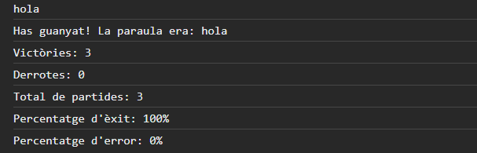
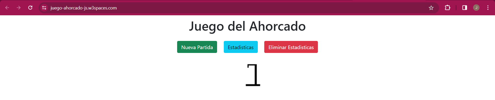

# Juego del Ahorcado en JavaScript

Este es un proyecto de implementación del juego del ahorcado en JavaScript y HTML, con estilos proporcionados por Bootstrap 5. Permite a los usuarios adivinar una palabra secreta y muestra estadísticas sobre el juego.

## Características

- Iniciar un nuevo juego con una palabra secreta.
- Adivinar letras y ver el progreso del juego.
- Mostrar estadísticas de partidas jugadas, ganadas y perdidas.
- Interfaz de usuario atractiva y responsiva gracias a Bootstrap 5.

## Tecnologías Utilizadas

- HTML
- JavaScript
- [Bootstrap 5](https://getbootstrap.com/)

## Cómo jugar

1. Abre el juego y selecciona "Iniciar un juego" desde el menú.
2. Ingresa una palabra secreta (por ejemplo, "casa").
3. Adivina letras para revelar la palabra secreta.
4. Comprueba las estadísticas para ver cuántas partidas has jugado, ganado y perdido.

## Capturas de Pantalla
### Parte 1 : Implementación del juego en JavaScript

### Parte 2 : Creación de la interfaz de usuario en HTML y JavaScript

## Autor

- Nombre: Jostin Cabascango
- Curso: DAW 2B
- Asignatura: M06 - Desarrollo Web en Entorno Cliente
- Año: 2023
- Repositorio de GitHub: (https://github.com/JostinCabascango)

## Enunciado de la Parte 1

### Implementación del juego en JavaScript

1. Iniciar el programa: Al iniciar el programa, muestra un menú con tres opciones: "Iniciar un juego," "Estadísticas" y "Salir." El usuario debe seleccionar una opción válida; de lo contrario, muestra un mensaje de error y vuelve a mostrar el menú hasta que se seleccione la opción "Salir."

2. Iniciar un juego: Cuando el usuario selecciona esta opción, solicita al usuario que ingrese una palabra secreta (por ejemplo, "casa"). Luego, muestra la longitud de la palabra en la consola con guiones bajos (por ejemplo, "_ _ _ _").

3. Jugar el juego: El programa le pide al usuario que ingrese una letra. Debes validar que el usuario haya ingresado solo una letra y que sea una letra válida (no se aceptan caracteres especiales ni números). El juego continúa hasta que el usuario adivine la palabra o se quede sin intentos.

4. Mostrar el progreso: Después de cada intento, muestra el progreso del juego en la consola, como "C _ S _" y la lista de letras incorrectas ("Lletres fallades 3/6: b, x, e").

5. Finalizar el juego: Cuando el usuario adivina la palabra o se queda sin intentos, muestra un mensaje de felicitación o derrota y vuelve al menú principal.

## Enunciado de la Parte 2

### Creación de la interfaz de usuario en HTML y JavaScript

1. Agrega botones HTML llamados "Iniciar partida" y "Estadísticas."

2. Define una función `novaPartida()` en JavaScript para iniciar una nueva partida.

3. Agrega divs en el HTML para mostrar el juego, el abecedario, la imagen del ahorcado y las letras utilizadas.

4. Crea un abecedario dinámico con botones para cada letra permitida. Cuando se hace clic en una letra, llama a una función `clickLletra(letra)` para procesarla.

5. Actualiza el juego en el div `jocPenjat` para mostrar el progreso y usa imágenes para representar el estado del ahorcado.

6. Muestra las letras utilizadas en el div `lletresUtilitzades`.

7. Bloquea los botones de las letras después de ser utilizados.

8. Si se hace clic en el botón "Estadísticas," abre una nueva ventana y muestra la información de estadísticas.

9. Muestra un `alert` al finalizar el juego.
